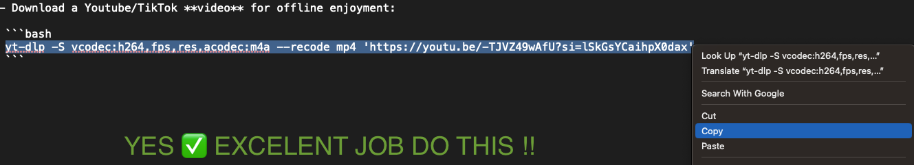
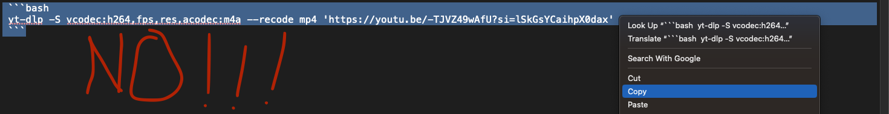

# YT-Scripts

## By Kezz

---

This article is in a format that will look funny in textedit on your computer, please view it online by [clicking here](https://github.com/Kezzsim/yt-scripts). It will also be updated from time to time if you encounter issues using it.

***Requirements***:
MacOS

***Prerequisites***:
Have [YT-DLP](https://github.com/yt-dlp/yt-dlp) and FFMPEG installed already

```bash
brew install yt-dlp && brew install ffmpeg
```

### Notes

Copy and paste these commands exactly please for the love of god. Here's what I mean.


You want the command to be just the one line in the code box that has what you need. To download a different video pweese change the url that's in between the single quotes to the URL of the video you want to download.
---

## Scripts

- Download a Youtube/TikTok **video** for offline enjoyment:

 ```bash
 yt-dlp -S vcodec:h264,fps,res,acodec:m4a --recode mp4 'https://youtu.be/-TJVZ49wAfU?si=lSkGsYCaihpX0dax'
 ```

- Download a Youtube/Tiktok video, **AS AN .MP3 AUDIO FILE**:

 ```bash
    yt-dlp -x --audio-format mp3 --audio-quality 0 'https://youtu.be/fzDZrPZ8s5c?si=K8L2g2HVSn8lTnFx'
 ```

---

## TODO

 [ ] Easier scripts that can be run with an interactive terminal or double click.
 [ ] Script to add album art to videos downloaded as .mp3
